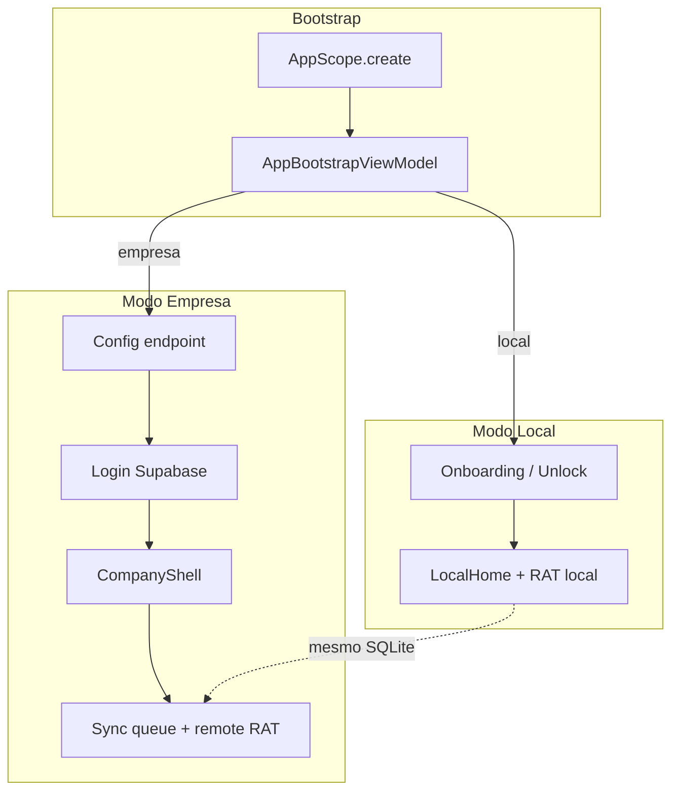

# 05 — Arquitetura

> **Proposito:** visao estrutural do software alinhada ao codigo real.
>
> **Fontes:** `documentacao/arquitetura.md`, `lib/`, `docs/prompt.md`,
> Flutter App Architecture Guide (referenciado em `docs/spec/README.md`).

## Visao em camadas

```text
┌─────────────────────────────────────────┐
│  presentation (telas, widgets, VMs)     │
├─────────────────────────────────────────┤
│  domain (entidades, repos, use cases)   │
├─────────────────────────────────────────┤
│  data (repos concretos, DTOs, services) │
├─────────────────────────────────────────┤
│  shared/infra (Drift, secure storage)   │
└─────────────────────────────────────────┘
         ↑ injetado via AppScope (app/di)
```

**Confirmado:** regras de dependencia respeitadas — domain nao importa
`supabase_flutter` nem `drift`.

## Bootstrap e navegacao

**Confirmado:**

1. `main.dart` → `bootstrap()` → `AppScope.create()`.
2. `TechReportApp` consulta `AppBootstrapViewModel` e renderiza um unico
   `AppShell` por estado (`AppBootstrapStatus`).
3. Modo empresa usa `CompanyShell` com areas: RATs, perfil, equipe, admin.

Arquivos-chave:

- `lib/app/bootstrap/bootstrap.dart`
- `lib/app/navigation/tech_report_app.dart`
- `lib/app/navigation/company_shell.dart`
- `lib/app/di/app_scope.dart`

## Modulos por feature

| Feature | Presentation | Domain | Data |
| --- | --- | --- | --- |
| `local_auth` | onboarding, unlock, home, import | sessao/tecnico local, use cases PIN | Drift repos, export/import services |
| `company_auth` | mode choice, config, login, conta | sessao remota, auth use cases | Supabase auth, secure token store |
| `rat` | lista, formulario | `Rat`, repos, share use case | Drift + Supabase remote rat |
| `signature` | captura | `Assinatura` | Drift + asset store local |
| `sync` | sync center | fila, checkpoint, process/download | Drift queue, enqueue use cases |
| `company_admin` | app_admin, admin_empresa | listagens admin | Supabase admin repo |

## Persistencia

### Local (Drift)

**Confirmado** — `TechReportLocalDatabase`:

- `tecnico_locals`, `sessao_locals`, `rats`, `assinaturas`, `sync_queue_items`;
- arquivo `tech_report_local.sqlite`;
- `schemaVersion` atual: **7**.

### Remoto (Supabase)

**Confirmado** — migrations `0001` a `0007`:

- `empresas`, `tecnicos`, `rats`, `app_admins`;
- RLS em todas; funcoes helper `is_app_admin()`, `current_tecnico_*`.

Migrations aplicadas **fora** do runtime Flutter.

## Integracao Supabase

**Confirmado:**

- `SupabaseClientFactory` monta client autenticado apos login;
- sync usa client com sessao Auth (correcao pos-Sprint 5 documentada);
- repositorios remotos mapeiam DTO ↔ tabelas `public.*`.

## Tema e UI compartilhada

**Confirmado** — evolucao Metric Slate:

- tokens: `metric_slate_colors.dart`, `metric_slate_spacing.dart`,
  `metric_slate_radii.dart`, `metric_slate_component_themes.dart`;
- widgets: `tech_report_card.dart`, `tech_report_state_view.dart`, etc.;
- tema aplicado em `MetricSlateTheme.light()`.

**Status:** Parcial — nem todas as telas migradas (Sprint 8 / 8.1 em
andamento internamente).

## Testes

**Confirmado** — pasta `test/` com testes de tema, widgets compartilhados e
algumas telas (`rat_list_screen_test.dart`, etc.).

**Pendencia:** cobertura automatizada ainda limitada; QA manual previsto na
Sprint 9.

## Decisoes arquiteturais relacionadas

Ver consolidacao em [09-decisoes-tecnicas.md](./09-decisoes-tecnicas.md).

## Diagrama de modos



**Confirmado:** ambos os modos compartilham `TechReportLocalDatabase`.
